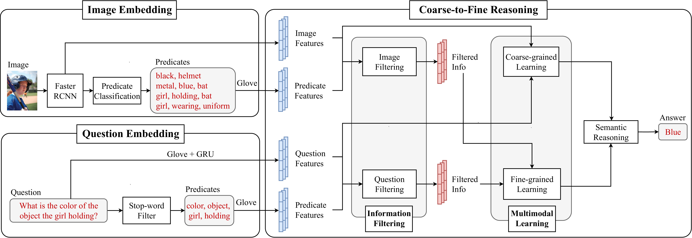

# Coarse-to-Fine Reasoning for Visual Question Answering

*Bridging the semantic gap between image and question is an important step to improve the accuracy of the Visual Question Answering (VQA) task. However, most of the existing VQA methods focus on attention mechanisms or visual relations for reasoning the answer, while the features at different semantic levels are not fully utilized. In this paper, we present a new reasoning framework to fill the gap between visual features and semantic clues in the VQA task. Our method first extracts the features and predicates from the image and question. We then propose a new reasoning framework to effectively jointly learn these features and predicates in a coarse-to-fine manner. The intensively experimental results on three large-scale VQA datasets show that our proposed approach achieves superior accuracy comparing with other state-of-the-art methods. Furthermore, our reasoning framework also provides an explainable way to understand the decision of the deep neural network when predicting the answer.*


*<center>**Figure 1**: An overview of our framework.</center>*

This repository is the implementation of `Coarse-to-Fine Reasoning Framework (CFR)` for the visual question answering task. Our proposal achieves comparative results on [GQA dataset](https://cs.stanford.edu/people/dorarad/gqa/index.html)

* During the challenge, we have considered integrating [LXMERT](https://github.com/airsplay/lxmert) into the CFRF. The setup further improves the overall performance in GQA validate set (75.86%; 2.26% higher than the original CFRF).

For the detail, please refer to [link](https://arxiv.org/abs/2110.02526). 

This repository is based on and inspired by @Jin-Hwa Kim's [work](https://github.com/jnhwkim/ban-vqa). We sincerely thank for their sharing of the codes.

## Summary

* [Prerequisites](#prerequisites)
* [Dataset](#dataset)
* [Training](#training)
* [Pretrained models and Testing](#pretrained-models-and-testing)
* [Citation](#citation)
* [License](#license)
* [More information](#more-information)

### Prerequisites

PYTHON 3.6

CUDA 9.2

Please install dependence package by run following command:
```
pip install -r requirements.txt
```
### Dataset

* **GQA dataset for VQA task** should be downloaded via [link](https://vision.aioz.io/f/c11580c0318846d1939c/?dl=1). The downloaded file should be extracted to `/kaggle/input/lxmert-gqa/gqa/` directory. Note that, the data has been pre-process to content all corresponding visual and language features mentioned in our paper.

### Training
Before training CRF models, please download the LXMERT pretrained model in [link](https://vision.aioz.io/f/2f6316d1b8794079b913/?dl=1) and move them to `pretrained/` directory.

To train the model using train set of GQA dataset, please follow:

```bash
sh train.sh
```

### Pretrained models and Testing

We also provide the pre-trained weights of our models on GQA dataset in [here](https://vision.aioz.io/f/aade8c6fd7104b11b2ab/?dl=1).  Please download and move them to `saved_models/GQA/replicate_result_default` directory. The pre-trained model can be tested in GQA test set via:

```bash
sh test.sh
```

### Citation

If you use this code as part of any published research, we'd really appreciate it if you could cite the following paper:

```
@inproceedings{nguyen2022coarse,
  title={Coarse-to-Fine Reasoning for Visual Question Answering},
  author={Nguyen, Binh X and Do, Tuong and Tran, Huy and Tjiputra, Erman and Tran, Quang D and Nguyen, Anh},
  booktitle={Proceedings of the IEEE/CVF Conference on Computer Vision and Pattern Recognition},
  pages={4558--4566},
  year={2022}
}
```

### License

MIT License

### More information
AIOZ AI Homepage: https://ai.aioz.io
